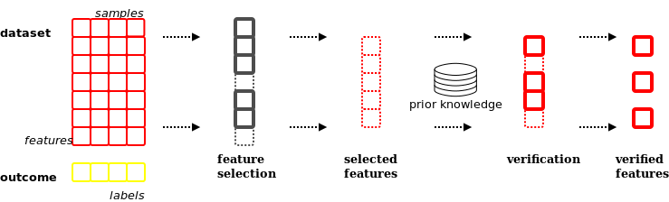
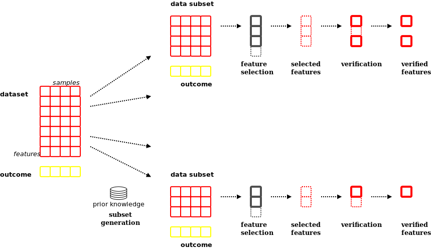

.. _background:

Background
**********

This section discusses theoretical background behind KDVS system.

Introduction
------------

KDVS provides experimental integration of numerical data and related prior
knowledge, to confirm existing statistically significant relations between data
bits (suggested by prior knowledge), and to discover new ones.

Data--driven world
------------------

Today many research fields as well as businesses constantly produce enormous
quantities of data. In order to find some sense in the flood of data, one needs
powerful algorithms that could identify meaningful relations between individual
data bits.

Traditional way of tackling this problem is to resort to well established data
mining algorithms and machine/statistical learning methods, that operate on data
alone. Those algorithms treat data as objects with mathematical properties and
without further "meaning" as understood by humans. In other words, classical
algorithms "do not know" about possible specific properties of individual data
bits that may shed some light on their inherent relationships.

In the context of KDVS, `prior knowledge` may be defined as the specific
representation of known facts that connect individual data bits. In other words,
if data bits refer to measures of some variables, prior knowledge refer to
entities those variables represent. Most frequently, prior knowledge represents
known facts about `grouping` variables into classes non--distinguishable from
purely numerical viewpoint. Such knowledge is often hard to encode and to
present in machine--readable form. However, its proper application to data
mining may provide tremendous positive impact.

For example, if variables are gene expression measurements, prior knowledge may
refer to already known properties of the genes, such as their function, family
of proteins they encode etc. If variables refer to quantities of products sold,
prior knowledge may refer to, for example, the family a product belongs to, type
of advertisement used for the product, associated products that may be presented
to potential customer etc.

High--throughput biology
------------------------

The main motivation of development of KDVS has come from life sciences. Wealth of
data being produced constantly, as well as abundance of prior knowledge in textbooks
and various databases, makes life science the primary target for the KDVS paradigm.

Modern biology tries to understand dense web of molecular interactions to uncover
underlying structure and mechanisms that describe biological organisms. This can
be done just for the sake of pure knowledge, or for more practical purpose,
such as searching for a cure that treats particular disease.

To do so, life science researchers need two important sources of information:
data and knowledge. `Data` typically comes from measurement of various kinds of
biological activities, and is available in numerical form. `Knowledge` typically
comes directly from researchers that try to understand biological mechanisms
and to codify the resulting processes in various forms.

The form of both sources of information is usually distinct. Numerical data is
non-readable directly, but provides wealth of informative relations that may be
hidden to human researchers. Knowledge base, while readable directly by any
researcher, may be difficult to adapt for numerical computational processes,
typically applied to data. That makes the open problem on its own: how to
`integrate` data and knowledge effectively? See, for example,
`this editorial <http://bib.oxfordjournals.org/content/9/6/451.full>`_
for an introduction to this topic.

The following description focuses on KDVS being applied to life science data.

High--throughput platforms
--------------------------

In the context of life sciences, KDVS operates on data produced by high--throughput
platforms (HTP). HTP is a workflow system utilized in modern life sciences,
composed of hardware and software, that quantifies many instances of
biological/physical phenomena simultaneously. For example, the amount of RNA
associated with many genes can be measured simultaneously on array--like plates,
or many ions may be identified simultaneously during mass spectrometry of the
peptide, or many short reads may be generated and assembled into contigs during
next--generation sequencing.

Typical run of HTP produces very big data streams (terabyte--level is not a rare
case) that need to be processed to reveal properties useful for understanding the
underlying phenomena. This may be done immediately after data production phase,
using tools provided by HTP manufacturer. However, it is possible to use other
tools, if the data stream itself is available, and data stream format is known.

Many manufacturers use proprietary data formats for data streams produced by
HTPs. However, it is very often the case that:

- manufacturer publishes data format specification

- manufacturer offers public API to handle its data format

- manufacturer enables data to be exported into portable formats, like DSV
  (delimiter separated values), that can be viewed with tools like Excel

The overall stream of data produced by HTP can be roughly divided in two parts:
numerical data and annotation metadata. `Numerical data` are direct results of
simultaneous measures of quantities. `Annotation data` provides additional
information related to those results, such as: what quantities those particular
numbers measure, what is the meaning of this measure, what are the environmental
features associated with those measures, what are the external concepts
associated with those measures etc.

Both numerical and annotation data are available in many binary or textual
formats, DSV being the most widespread textual format.

To work, KDVS needs both numerical data and annotation metadata.

.. _background_priorknowledge:

Prior knowledge
---------------

As stated above, prior knowledge usually refers to some properties of
measurements that are not easily deducible from numbers alone. Very often it
refers to how variables measured `group` in some way. For example, when gene
expression is measured, prior knowledge may refer to `grouping` of genes into
functional families, into classes that share some physical property such as
folding dynamics, etc.

Prior knowledge is often `hierarchical`, where grouping categories can be seen
as "tree" of categories, where more specific categories are derived from more
general categories.

Since category of prior knowledge can refer to virtually anything, KDVS uses
very general term "*prior knowledge concept*" when referring to it (also in the
form of "*PK concept*" or simply "*PKC*").

One of the popular sources of prior knowledge in life science is
`Gene Ontology <http://www.geneontology.org>`_ (GO),
that groups genes into categories associated with specified biochemical terms.
Categories are referred to as "terms", and gene is associated with a term based
on `evidences` that come from experimental research and subject literature.
Gene Ontology terms form `directed acyclic graph` (DAG), where given term can
have many children terms as well as many ancestor terms.

KDVS was designed primarily to utilize prior knowledge coming from Gene Ontology.
In order to do so, it needs to process `representation of GO DAG` that is provided
by Gene Ontology consortium. The representation understood by KDVS comes in
`OBO-XML <http://www.geneontology.org/GO.format.shtml#OBO-XML>`_
file.

.. _background_dataandknowledgeintegration:

Data and knowledge integration
------------------------------

When data and prior knowledge are integrated in classic way, most frequently
data are processed with data mining/machine learning algorithms in order to
select significant variables. Then, such variables are `verified` against prior
knowledge to shed some light on how selected variables are in fact related.
This approach, while convenient, has considerable drawbacks. Among others, variable
selection is performed purely by numerical algorithm that may need fine--tuning
by itself, or prior knowledge is consulted too late without any possible impact
on variable selection (the knowledge has its power "not fully utilized").

    Classic approach to data and knowledge integration.

    Any feature selection method may be used and any verification method may be applied.

KDVS represents one of possible approaches to `integrate` data and corresponding
prior knowledge, where variables are not simply "pre--selected" before consulting
prior knowledge. Here, prior knowledge is used to `transform` original problem
into smaller ones, by constructing subsets of original dataset that are related
to particular groups of variables. In this context, prior knowledge consists of
`concepts`, i.e. "classes" of variables. Such classes can overlap, and therefore
related subsets also can overlap. Next, variable selection is performed on those
smaller subsets. Also, classification may be performed (binary or multi), if
dataset consists of variables that were measured across two or more distinct
entities, e.g. two or more distinct groups of patients, such as sick and controls,
two or more distinct customer groups, etc. The output of KDVS consists of variables
selected for each data subset, as well as the list of significant prior knowledge
concepts that correspond to good prediction performance of related data subsets;
most frequently, this means simply low classification error.

    KDVS approach to data and knowledge integration.

    Any feature selection method may be used and any verification method may be applied.

.. _background_inputdata:

Input Data
----------

Overview
========

Delimiter Separated Values
++++++++++++++++++++++++++

DSV stores two-dimensional arrays of data, or two-dimensional data slices in
case of multi-dimensional data, in rows of plain text elements, separating
them with special delimiter characters. For example::

  0.00001,0.00002,"Example data string",'33333'
  333,"Another data string",+++,0.55,111,"Tricky, but possible"
  
Here, the delimiter character is comma `\",\"`, and the data are stored
as CSV (comma-separated values). Among other standard delimiter characters are
tabulator `\"\\t\"` (TSV, tabulator-separated values, accordingly), colon
`\".\"` and pipe `\"|\"`.

As seen in second line, delimiter character may often be "embedded" in the element
itself, when the element is `enclosed` in specified characters such as single
or double quotas. However, some DSV parsers may not honor this.

Many spreadsheet and database applications allow reading and writing data in DSV
portable formats. Since the most common "dialect" of DSV is CSV, it will be often
referred as such.

Very often, the CSV data file is coming up with a "header line", containing
names for the "columns" of values, and "row names", containing the name for
every row. For example::
  
  "Row ID","Column1","Column2","Column3"
  "Row1",1.00,2.00,3.00
  "Row2",4.00,5.00,6.00
  
In this case, `Column1` represents the set of values `1.00, 4.00`, `Column2`
represents the set of values `2.00, 5.00`, etc; `Row1` represents the set of
values `1.00, 2.00, 3.00` etc. Therefore many DSV parsers are able to extract
not only simply rows, but also columns of data.

Numerical data
++++++++++++++

Numerical data, typically being huge, may be stored and transmitted in some
compact binary format by correspondent HTP technology, but in most cases it will
be available also in DSV format, as a simple series of numerical values::

    "Row ID","Column1","Column2","Column3"
    "Row1",1.00,2.00,3.00
    "Row2",4.00,5.00,6.00

Currently, KDVS processes numerical data in the form of properly formed DSV files.

.. note::

  It is often the case that numerical CSV data file comes as output from R
  `write.table` family of functions. With the default set of options for those
  functions, the header line, if present, contains one column less. For example::

    "Column1","Column2","Column3"
    "Row1",1.00,2.00,3.00
    "Row2",4.00,5.00,6.00

  Such CSV file is not conforming to standard CSV formatting rules. Therefore,
  to be processed by KDVS, it must contain `full` header line, even if there is
  no name for the first column. Here, the first column name is empty string::

    ,"Column1","Column2","Column3"
    "Row1",1.00,2.00,3.00
    "Row2",4.00,5.00,6.00

  R documentation regarding writing CSV files:
  
  * `R Data Import/Export <http://cran.r-project.org/doc/manuals/R-data.html#Export-to-text-files>`_
  * `write.table <http://stat.ethz.ch/R-manual/R-patched/library/utils/html/write.table.html>`_

Annotation metadata
+++++++++++++++++++

"Raw" stream of numerical data, however, is not very useful. Additional
information about this data is usually provided, such as: what quantities those
particular numbers measure, what is the meaning of this measure, what are the
environmental features associated with those measures, what are the external
concepts associated with those measures etc. This information is provided
in the form of annotation metadata.

Unlike simple numerical measures, annotation metadata may contain much richer
information, such as: arbitrary text strings of any format, date and time strings,
record--like substructures etc.

Typically, annotation metadata comes in the form of DSV files, so all the remarks
mentioned before apply here as well. However, since the information is much more
complicated, it takes considerable amount of time to parse it properly and to
extract all relevant information.

Below is the complete example of annotation metadata in TSV format that
accompanies gene expression measurements performed on Affymetrix microarray chip;
presented are header line and two data lines::

    ID  GB_ACC  SPOT_ID Species Scientific Name Annotation Date Sequence Type   Sequence Source Target Description  Representative Public ID    Gene Title  Gene Symbol ENTREZ_GENE_ID  RefSeq Transcript ID    Gene Ontology Biological Process    Gene Ontology Cellular Component    Gene Ontology Molecular Function
    1007_s_at   U48705      Homo sapiens    Mar 11, 2009    Exemplar sequence   Affymetrix Proprietary Database U48705 /FEATURE=mRNA /DEFINITION=HSU48705 Human receptor tyrosine kinase DDR gene, complete cds U48705  discoidin domain receptor tyrosine kinase 1 DDR1    780 NM_001954 /// NM_013993 /// NM_013994   0006468 // protein amino acid phosphorylation // inferred from electronic annotation /// 0007155 // cell adhesion // traceable author statement /// 0007155 // cell adhesion // inferred from electronic annotation /// 0007169 // transmembrane receptor protein tyrosine kinase signaling pathway // inferred from electronic annotation  0005887 // integral to plasma membrane // traceable author statement /// 0016020 // membrane // inferred from electronic annotation /// 0016021 // integral to membrane // inferred from electronic annotation  0000166 // nucleotide binding // inferred from electronic annotation /// 0004672 // protein kinase activity // inferred from electronic annotation /// 0004713 // protein tyrosine kinase activity // inferred from electronic annotation /// 0004714 // transmembrane receptor protein tyrosine kinase activity // traceable author statement /// 0004714 // transmembrane receptor protein tyrosine kinase activity // inferred from electronic annotation /// 0004872 // receptor activity // inferred from electronic annotation /// 0005515 // protein binding // inferred from physical interaction /// 0005524 // ATP binding // inferred from electronic annotation /// 0016301 // kinase activity // inferred from electronic annotation /// 0016740 // transferase activity // inferred from electronic annotation
    1053_at M87338      Homo sapiens    Mar 11, 2009    Exemplar sequence   GenBank M87338 /FEATURE= /DEFINITION=HUMA1SBU Human replication factor C, 40-kDa subunit (A1) mRNA, complete cds    M87338  replication factor C (activator 1) 2, 40kDa RFC2    5982    NM_002914 /// NM_181471 0006260 // DNA replication // not recorded /// 0006260 // DNA replication // inferred from electronic annotation /// 0006297 // nucleotide-excision repair, DNA gap filling // not recorded 0005634 // nucleus // inferred from electronic annotation /// 0005654 // nucleoplasm // not recorded /// 0005663 // DNA replication factor C complex // inferred from direct assay /// 0005663 // DNA replication factor C complex // inferred from electronic annotation   0000166 // nucleotide binding // inferred from electronic annotation /// 0003677 // DNA binding // inferred from electronic annotation /// 0003689 // DNA clamp loader activity // inferred from electronic annotation /// 0005515 // protein binding // inferred from physical interaction /// 0005524 // ATP binding // traceable author statement /// 0005524 // ATP binding // inferred from electronic annotation /// 0017111 // nucleoside-triphosphatase activity // inferred from electronic annotation

Currently, KDVS processes annotation metadata in the form of properly formed DSV
files, as well as in some few more exotic formats, when proper parsing strategy
is available.

Prior knowledge representation
++++++++++++++++++++++++++++++

Since prior knowledge is by itself a very general term, handling of it is
implemented in KDVS in modular way. Therefore, each specific module will use its
own `prior knowledge representation`. For example, `Gene Ontology` hierarchy of
terms can be represented as `directed acyclic graph`, that may be encoded in
various ways and stored in various formats; see :ref:`background_priorknowledge`
for more details.

Data as seen by KDVS
====================

.. _background_measurementdatamatrix:

Measurement Data Matrix
+++++++++++++++++++++++

As outlined in :ref:`background_dataandknowledgeintegration`, the paradigm of KDVS
is based on many `classification tasks` that are performed with some machine
learning technique on supplied numerical data. Classification by definition
requires data that come from two or more `distinct` sources (e.g. biological
samples), in order for the technique to differentiate between them.

Regarding KDVS, this is reflected in the form of numerical data. Measurements from
samples are all pooled into one single matrix, referred to as `Measurement Data
Matrix` (*MDM*), as depicted on :ref:`Figure 1 <overview-fig1>`.

    Depiction of the concept of Measurement Data Matrix (MDM).

    ..

.. note::

    KDVS pays particular attention to the orientation of MDM matrix (*P x N*).
    It *must* have measurements of specified variable for each sample *in rows*.
    This is due to speedup the `local data integration` step (see :ref:`framework`).

.. warning::

    In machine learning literature, very often the `transposed` orientation
    is used (*N x P*), where measurements of specified variable for each sample
    come *in columns*. Data in transposed orientation may also come from many
    preparatory software packages without warning. KDVS does its best to `correct`
    orientation if it seems improper, but user is advised to control the matrix
    orientation directly through preparatory stage and use the correct one when
    preparing MDM for KDVS.

Typically, MDM coming from DSV file is loaded into KDVS database system, governed
by :class:`~kdvs.core.db.DBManager` instance. The MDM, together with
:ref:`background_annotationmatrix`, is used to create data subsets that are
wrapped into :class:`~kdvs.fw.DataSet.DataSet` instances. See :ref:`framework`
for more details.

.. _background_labelinformation:

Label information
+++++++++++++++++

For classification tasks performed in the setting of supervised learning, it is
necessary to provide the label information. The series of measurements are usually
made for several sources (also called "samples"), that can be grouped according
to their specificity. For instance, one may measure gene expression in blood
samples coming from two separated group of people, such as the diseased ones and
"control" (healthy) ones, and each group has assigned a numerical `label`, such
as 1 and -1. Typically, two classes of samples are used, and two labels are
assigned ("two--class learning"); it is also possible to define more classes of
samples and more labels, however the numerical procedures become more complicated
("multi--class learning").

The label information may come in the form of DSV file, for example:

======= ======
samples labels
======= ======
<S1>    1
<S2>    -1
...     ...
<Sp>    -1
<Sr>    1
...     ...
<Sn>    1
======= ======

The handling of input and loading of label information is left to the user.
Typically, the DSV file is loaded into KDVS database system, governed by
:class:`~kdvs.core.db.DBManager` instance. Ultimately, KDVS stores the label
information in the :class:`~kdvs.fw.Stat.Labels` instance. See :ref:`framework`
for more details.

.. _background_annotationmatrix:

Annotation matrix
+++++++++++++++++

Annotation matrix contains mapping between prior knowledge concepts and variables
from MDM matrix, as well as many other information bits associated with variables;
it may be presented in various forms. For example, when gene
expression data is obtained from microarray, annotation matrix may be supplied
directly by microarray manufacturer or may be assembled independently by
scientific community. Here, expression is measured for specific short sequences
(probes), that may be grouped into probesets; such sequences could be mapped to
genes. The annotation matrix may contain, among others, the mapping between
probe(set)s, genes and Gene Ontology terms, as follows:

=== =============== === ============ === ===================== === ========================== ===
... <Probe(set) ID> ... <Gene ID>    ...  <Annotation Type K>  ...          GO term(s)        ...
=== =============== === ============ === ===================== === ========================== ===
... <ID1>           ... <GeneID1>    ... <annotationK1>        ...    term1,term2,...,termT1  ...
... <ID2>           ... <GeneID2>    ... <annotationK2>        ...    term1,term2,...,termT2  ...
... <ID3>           ... <GeneID3>    ... <annotationK3>        ...    term1,term2,...,termT3  ...
... ...             ... ...          ... ...                   ...    ...                     ...
... <IDP>           ... <GeneIDP>    ... <annotationKP>        ...    term1,term2,...,termTP  ...
=== =============== === ============ === ===================== === ========================== ===

As depicted, the example annotation matrix contains mapping *measurement -> gene -> term*.
That is very often the typical case. In KDVS, however, we are interested more
in the `reverse` mapping *term -> gene -> measurement*, that allows directly the
construction of data subsets associated with individual GO terms. This is also
true for any general mapping *measurement -> PKC*, where we look for associated
reverse *PKC -> measurement* mapping. KDVS performs the mapping reversal
automatically.

Typically, annotation matrix that comes from DSV file is loaded into KDVS database
system, governed by :class:`~kdvs.core.db.DBManager` instance. Based on that
information, the construction of *PKC -> measurement* mapping should be implemented
in :class:`~kdvs.fw.Map.PKCIDMap` instance. See :ref:`framework` for more details.

.. _background_priorknowledgerepresentation:

Prior knowledge representation
++++++++++++++++++++++++++++++

Since handling of prior knowledge is implemented in modular way, implementation
details and data formats are specific for individual modules. For example, in
case of Gene Ontology, KDVS accepts `directed acyclic graph` of GO terms in
`OBO-XML` file, and builds portable representation of the term graph that is
used throughout system lifetime. In general case, a new :class:`~kdvs.fw.PK.PKCManager`
component may be implemented that handles prior knowledge of requested type.
See :ref:`framework` for more details.
