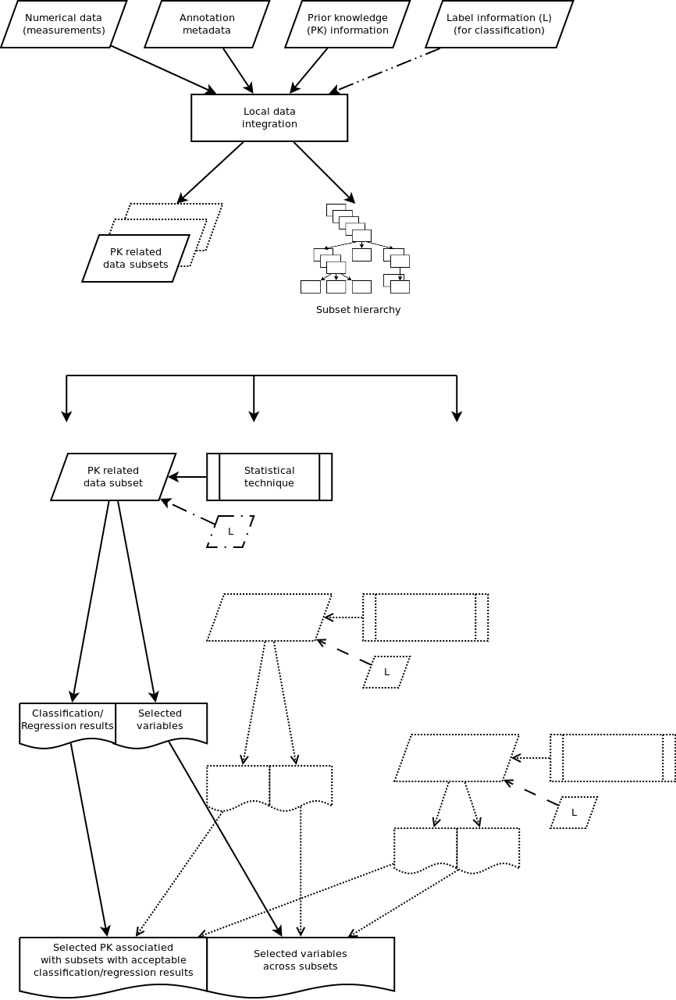
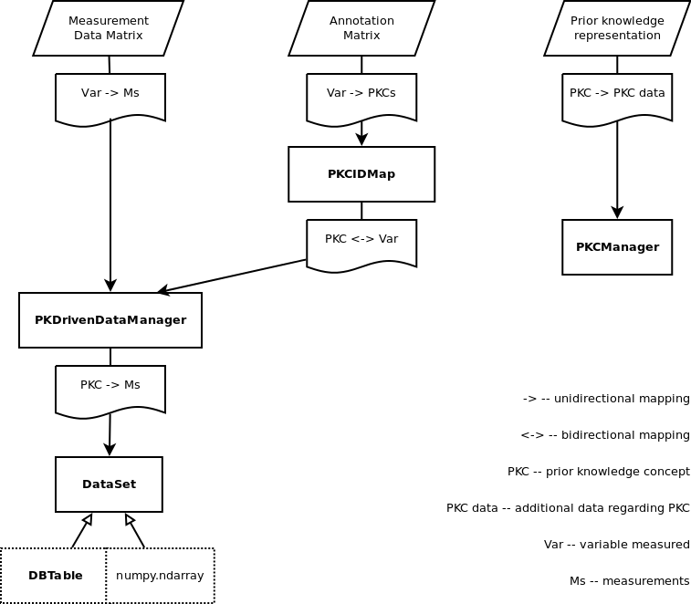
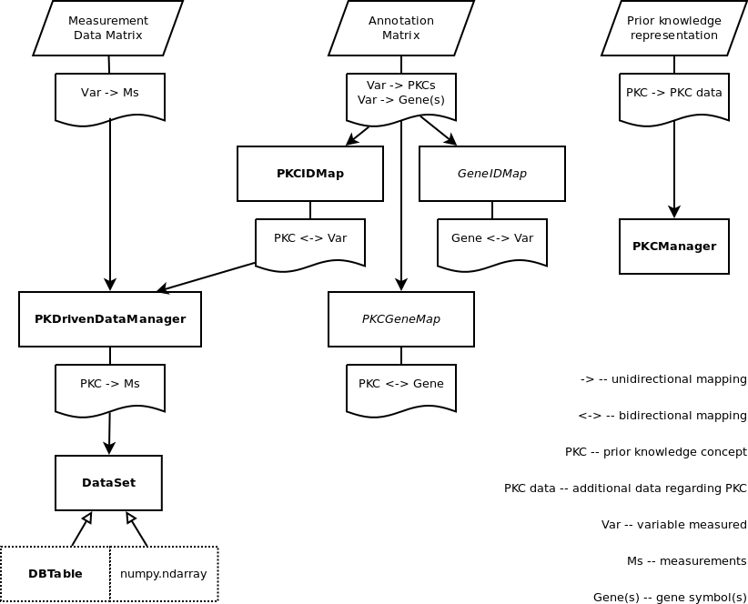
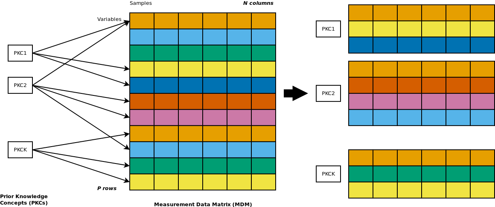
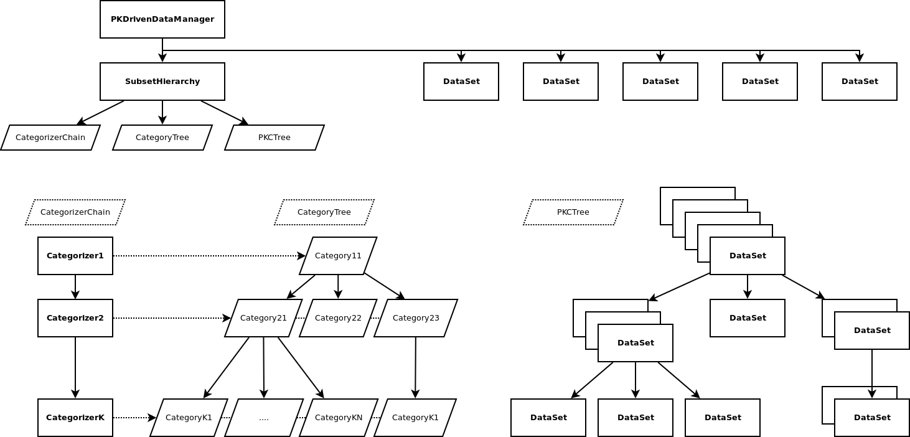
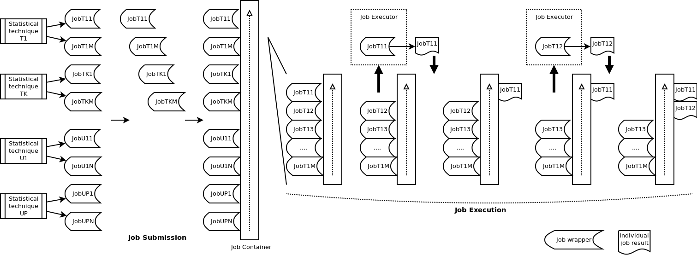
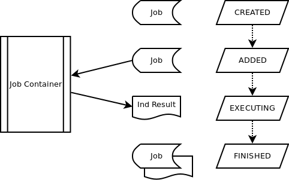

.. _framework:

Framework
*********

This section describes the conceptual framework of KDVS.

.. _framework_informationflow:

Information flow
----------------

A schematic flow of information within KDVS system is presented on :ref:`Figure 1 <framework-fig1>`.

    Depiction of schematic information flow within KDVS system.

    ..

The system gathers together numerical data (in the form of :ref:`background_measurementdatamatrix`),
annotation metadata (in the form of :ref:`background_annotationmatrix`),
:ref:`background_priorknowledgerepresentation`, as well as optional
:ref:`background_labelinformation` for classification tasks, and performs
`local data integration` that produces individual data subsets related to prior
knowledge concepts. Note that since single concept may refer to many variables
and variables may overlap between concepts, also data in subsets may overlap.

Next, statistical technique is performed on each data subset, along with optional
label information. Statistical technique must perform classification or regression
task on data subset; it may also perform variable selection (in statistical learning
sense), but it is not required. The output from statistical technique usually
consists of: a result of classification/regression task, and a list of selected
variables that highlight the difference between two or more distinct states.
Result of classification/regression task comes in numerical form; in case of
classification it is usually the `classification error`, and in case of regression
it is simply a numerical result of regression procedure.

Next, KDVS gathers all "selected" prior knowledge concepts that performed
`acceptably` during classification/regression tasks, as well as all selected
variables across all data subsets (selected or not).

.. note::

    "Statistical technique" by itself is an abstraction that includes many possible
    computational techniques from machine learning, statistical learning, and
    data mining. The only common denominator for statistical technique is that
    it must perform a classification or regression task for given data subset,
    while the details may differ for each implementation. Refer to each
    technique for individual details.

.. note::

    All technical details like construction of training/test sub--subsets from data
    subset, optional cross--validation, etc. are by definition hidden inside
    implementations of statistical techniques. Refer to each technique for
    individual details.

.. note::

    KDVS concept of "variable selection" is more general than the one referred
    in machine learning literature. In short, if statistical technique performs,
    along with classification/regression, also proper variable selection, KDVS
    reports those variables as "selected" (as expected). However, when the
    technique does not select variables in machine learning sense, KDVS may still
    classify some of them as "selected" and report them as such. This generalization
    was introduced to provide consistent output for various statistical techniques.

.. note::

    The actual output of KDVS contains much more information than simply two
    lists. Much of the output actually depends on individual implementations
    of statistical techniques, and reporting itself is configurable to accomodate
    the user needs.

.. _framework_localdataintegration:

Local data integration
----------------------

A schematic view of local data integration, performed in general way, is presented
on :ref:`Figure 2 <framework-fig2>`.

    Depiction of schematic view of local data integration (general way).

    General objects that can be used for any kind of data are depicted with
    **bold names**. Objects specific for biological applications are depicted
    with *italic names*. Derived objects are depicted with dotted outline.

Local data integration is based on the concepts of uni-- and bidirectional mappings.
If mapping between A and B is unidirectional (A->B), it is possible to obtain
only B having A (A->B), and if mapping is bidirectional (A<->B), it is possible
to obtain both B having A (A->B) and A having B (B->A) without additional cost.
KDVS provides abstract class :class:`~kdvs.fw.Map.BDMap`, as well as two concrete
classes, :class:`~kdvs.fw.Map.ListBDMap` and :class:`~kdvs.fw.Map.SetBDMap`,
for this purpose.

For KDVS to perform local data integration correctly, :class:`~kdvs.fw.Map.PKCIDMap`
object must be constructed. It contains bidirectional mapping between prior
knowledge concepts (PKCs) and variables being measured (PKC <-> Var). This
information should come from annotation matrix. Depending on individual
implementation, annotation matrix may contain only unidirectional part of this
mapping, e.g. (Var -> PKC). In this case, implementation of PKCIDMap shall
construct complementary part (PKC -> Var) and use proper implementation of
:class:`~kdvs.fw.Map.BDMap` to hold final bidirectional map (PKC <-> Var).

Next, after :class:`~kdvs.fw.Map.PKCIDMap` is created, a concrete instance of
:class:`~kdvs.fw.impl.data.PKDrivenData.PKDrivenDataManager` must be constructed.
This object manages creation of individual data subsets associated with prior
knowledge concepts. Currently, single concrete implementation is provided that
uses database backend (:class:`~kdvs.fw.impl.data.PKDrivenData.PKDrivenDBDataManager`).

Construction of :class:`~kdvs.fw.impl.data.PKDrivenData.PKDrivenDataManager`
completes the phase of local data integration. From this manager, the instances of
:class:`~kdvs.fw.DataSet.DataSet` objects can be obtained.
:class:`~kdvs.fw.DataSet.DataSet` objects hide implementation details of actual
data subsets that depend on the used backend. As a convenience, it is possible to
obtain directly an instance of :class:`numpy.ndarray` of the data subset, to be
passed to statistical techniques later on.

If necessary, more complicated schema of local data integration may be devised.
For instance, when processing gene expression data obtained with microarrays,
it is necessary to map Gene Ontology terms not only to individual measurements
(i.e. probe(set)s), but also to `gene names`, and this process must be well defined.
An example implementation is presented on :ref:`Figure 3 <framework-fig3>`.

    Depiction of schematic view of local data integration (specialized).

    General objects that can be used for any kind of data are depicted with
    **bold names**. Objects specific for biological applications are depicted
    with *italic names*. Derived objects are depicted with dotted outline.

Here, two additional mappings, :class:`~kdvs.fw.Map.PKCGeneMap` and
:class:`~kdvs.fw.Map.GeneIDMap`, are constructed. The mappings participate in
generation of bioinformatic annotations for KDVS results.

.. _framework_datasubsets:

Data Subsets
------------

Having :ref:`background_measurementdatamatrix` and at least :class:`~kdvs.fw.Map.PKCIDMap`
bi--directional mapping constructed, KDVS transforms monolithic MDM matrix into
smaller subsets. Each single data subset corresponds to single prior knowledge concept.
Subsets may `overlap`, as presented on :ref:`Figure 4 <framework-fig4>`.

    Depiction of generation of data subsets based on mapping between measurements and prior knowledge concepts.

All possible data subsets are generated at once. Empty data subsets are discarded.
Note that `masking` of primary data set occurs only with regard to rows, i.e. subsets
are determined entirely based on variables. All columns (i.e. samples) are
retained. That allows to perform classification or regression on the subset
exactly as on primary data set.

.. note::

    Currently there are no `filters` that allow skipping certain variables
    (seen as rows in MDM matrix) before subsets generation, and the MDM matrix
    is treated "as-is". There is, however, a possibility to skip certain `subsets`
    from processing with `blacklisting categories`. See :ref:`framework_subsethierarchy`
    for more details.

.. note::

    Currently, the only possibility of eliminating some samples from processing
    (seen as columns in MDM matrix) is to assign `unused label` to some sample(s)
    (such as 0), and to specify that label during creation of :class:`~kdvs.fw.Stat.Labels`
    instance. See also :ref:`background_labelinformation` for more details.

.. _framework_subsethierarchy:

Subset Hierarchy
----------------

A schematic view of subset hierarchy concept is presented on :ref:`Figure 5 <framework-fig5>`.

    Depiction of schematic view of subset hierarchy concept.

    General objects that can be used for any kind of data are depicted with
    **bold names**. Attributes are depicted with rhomboids. Association of
    categories with categorizers are depicted with dotted lines.

Data subsets based on MDM data may be considered equal or may be grouped into
subgroups based on some properties. For example, subsets obviously can come with
different `sizes`, which could affect computational time of statistical technique
that will work with them. Also, we may decide to assign different statistical
techniques to different subsets based on heuristical properties of prior knowledge
itself. Last but not least, we may want to `exclude` certain subsets from processing
at all.

The idea of 'subset hierarchy' was devised to allow such subset grouping.
In general, subsets can be `categorized` by specialized objects called
`categorizers`, that decide how to classify the subset when they see it.
:class:`~kdvs.fw.Categorizer.Categorizer` objects are coming with 'categories'
that can be assigned to individual subsets.

For example, categorizer tasked with dividing subsets in two groups according to
specified size threshold, may come with two specified categories, named '>' and
'<=', where category '>' is assigned to a subset if its size is greater than
the specified threshold, and category '<=' is assigned to a subset if its size
is less or equal than the threshold (see :class:`~kdvs.fw.impl.data.SubsetSize.SubsetSizeCategorizer`
for an example implementation).

For another example, if one wants to exclude specified subsets, given in the form of
`subset blacklist,` from further processing, one may come up with a categorizer
that presents two categories, named 'accepted' and 'notaccepted', where subset
is 'accepted' if it is not present on a provided `blacklist`, or excluded otherwise.

Categorizers may be further grouped in hierarchy. This may be useful, for example,
when user wants to apply `blacklisting` first, and then divide `accepted` subsets
according to their size. To resolve situations like this, `subset hierarchy`
manager (:class:`~kdvs.fw.SubsetHierarchy.SubsetHierarchy`) keeps track of
`category tree`, where categories from individual
categorizers are grouped in tree, and the tree reflects their dependence upon
each other. More specifically, for categories A and B, when A is the ancestor
of B in the tree, category B is allowed to classify `only` the subsets that
are already classified with category A. To avoid category clashes (e.g. when two
different categorizers have a category with the same name), categories are stored
in category tree in `uniquified` way, that is, category is prefixed with
categorizer specific ID. See :class:`~kdvs.fw.impl.data.PKDrivenData.PKDrivenDBSubsetHierarchy`
for an example implementation that uses
:class:`~kdvs.fw.impl.data.PKDrivenData.PKDrivenDBDataManager`.

An additional helper structure is `categorizer chain`, when categorizers are
ordered according to the presence of their categories in the tree. In other
words, categorizer chain refers to the `levels` of the category tree.

Since it is computationally not feasible to keep all instances of individual
:class:`~kdvs.fw.DataSet.DataSet` objects in a tree structure, only the ID of PKC
(prior knowledge concept) associated with the subset (also referred to as "symbol")
is kept in the tree (more specifically, in a data structure that resembles B--tree).
Therefore, the last helper additional structure, `PKC tree`, holds a tree of lists
of PKCs affected by individual categories. The length of PKC lists typically decreases
when moving down the tree, since categories downstream accept progressively
smaller lists of subsets as their input. In other words, subsets in leaf
categories are "the most precisely specified", all decision making has been
completed, and usually final processing takes place on those subset groups.
The `PKC tree` is stored in :class:`~kdvs.fw.SubsetHierarchy.SubsetHierarchy`
instance.

.. _framework_subsetordering:

Subset Ordering
---------------

Having `category tree`, and considering all subsets in single category, it is
sometimes desirable to process them in certain order. For instance, subsets from
category '>' of :class:`~kdvs.fw.impl.data.SubsetSize.SubsetSizeCategorizer`,
are good candidates for applying variable selection on them. Typically,
this takes considerable computational time, and one would like to finish as soon
as possible. If parallel computation could be used, and only few CPUs are available
for parallelization, a good strategy would be to apply variable selection on
`largest subsets first`, and continuing on progressively smaller ones. That way,
total computational time will be smallest.

KDVS uses the concrete instances of :class:`~kdvs.fw.Categorizer.Orderer` class
to control the ordering of subsets in each category. Currently, few implementations
are available, such as :class:`~kdvs.fw.impl.data.Null.NullOrderer`, that just
returns given subsets without any reordering, and :class:`~kdvs.fw.impl.data.SubsetSize.SubsetSizeOrderer`,
that re-orders subsets according to their `size`.

.. _framework_statisticaltechniques:

Statistical Techniques
----------------------

Having ordered subsets in single category, a `statistical technique` is applied
to each of them. The `statistical technique` is an umbrella term that encompasses
any properly implemented algorithm that performs classification or regression
on given data subset, together with variable selection if applicable.
Statistical technique accepts exactly one data subset to process, and optionally,
label information.

Some statistical techniques, especially those that perform
`model selection <http://en.wikipedia.org/wiki/Model_selection>`__,
may employ
`cross validation <http://en.wikipedia.org/wiki/Cross-validation_(statistics)>`__,
i.e. may split data subset into smaller training and test `sub-subsets`, sometimes
in many iterations. Each such `split` may have high computational cost. In order
to ease implementation of those techniques, statistical techniques in KDVS produce
individual `jobs` that are scheduled to be executed. The execution of one job
is completely separated from the execution of another. See also :ref:`framework_jobcreationandexecution`
for more details. Of course, when technique does not need to perform any splits,
a single job can be produced that will simply contain proper single call.

Originally, KDVS was designed to work with L1L2, statistical learning technique
that performs both classification and variable selection on data subset,
and uses cross-validation for successful parameter estimation. In this case,
data subset is split into series of training and test sub-subsets, and classification
performance is established over them, as well as the most meaningful variables are
collected. This technique has been implemented in KDVS as `reference one`, that
produces the most statistically relevant results.

In general, simpler techniques are also possible to be implemented, as long as
they follow some design principles laid originally for L1L2. For instance,
L1L2 provides both classification performance on test splits and selected variables
of data subset. While convenient, it is time consuming. With this in mind, one
can implement a technique that performs model selection and variable selection
separately, or skip variable selection entirely and focus only on classification
performance. With that many possibilities, the one important aspect of KDVS work
is to `select` some entities (prior knowledge concepts, individual measurements)
as relevant or meaningful, based on whatever criteria the technique author sees
fit. See :ref:`framework_selecting` for more details.

Statistical techniques are concrete implementations of :class:`~kdvs.fw.Stat.Technique`
class. Each technique must produce at least one :class:`~kdvs.fw.Job.Job` instance
that does its computational work. Also, each technique must produce exactly one
:class:`~kdvs.fw.Stat.Results` instance, that will hold results of the technique.
See also :ref:`framework_results` for more details. Some concrete implementations
include :class:`~kdvs.fw.impl.stat.L1L2.L1L2_L1L2`, :class:`~kdvs.fw.impl.stat.L1L2.L1L2_RLS`,
and :class:`~kdvs.fw.impl.stat.L1L2.L1L2_OLS`, that use `l1l2py <http://slipguru.disi.unige.it/Software/L1L2Py/>`__
library.

.. note::

    Any concrete implementation of statistical technique is responsible for
    managing its jobs. Since many techniques can be used during single KDVS run,
    the implementation must also `identify` jobs properly in order to `reconstruct`
    final results, e.g. from cross-validation. :class:`~kdvs.fw.Job.JobGroupManager`
    may help in those cases.

.. note::

    Typically, the concrete implementation of statistical technique requires also
    some concrete implementation(s) of :class:`~kdvs.fw.Report.Reporter` class,
    as well as :class:`~kdvs.fw.Stat.Selector` class. See :ref:`framework_reporting`
    and :ref:`framework_selecting` for more details.

Degree(s) of freedom
++++++++++++++++++++

Sometimes it is necessary to execute `parametrized` statistical technique for
each value of a parameter from a certain range. KDVS provides the concept of
"`degrees of freedom`" to facilitate the separation of the results for each
individual parameter value.

It is up to the technique to manage all individual parameter values and create
jobs with proper calls. KDVS associates each parameter value with `symbols` defined
with the technique. See :ref:`annex_globaltechniqueparameters` for more details.

.. _framework_results:

Results
-------

:class:`~kdvs.fw.Stat.Results` instances serve as general containers for final
results obtained from execution of statistical technique on single data subset.
Each Results instance functions similar to Python :class:`dict` instance, where
keys are `descriptive strings`, and values are of any valid Python type. Each
key--value pair is referred to as "`named element`". The value itself could be a
dictionary, therefore the following syntax works::

    Results['element_name']['subelement_name1']...['subelement_nameN']

In the documentation, such nested hierarchy of named elements is represented as::

    'element_name'->'subelement_name1'->...->'subelement_nameN'

When Results instance is created by concrete implementation of statistical technique
(see :ref:`framework_statisticaltechniques` for more details), essentially, the
technique fills Results dictionary with output information that can be simply
`stored` for reference (thus providing preservation), and/or `reported` immediately
when KDVS finishes.

The typical usage pattern is as follows. Technique implementation specifies in
its API the `named elements` of Results that will be produced::

    'Parameter Values' (tuple of integer)
    'Individual Errors Across Parameter Values' (tuple of float)
    'Avg Classification Error' (float)
    'Med Classification Error' (float)

and fills them in::

    # inside technique
    import numpy
    res = Results(...)
    res['Parameter Values'] = (1, 2, 3)
    res['Individual Errors Across Parameter Values'] = (0.5, 0.7, 0.9)
    res['Avg Classification Error'] = numpy.avg(res['Individual Errors Across Parameter Values'])
    res['Med Classification Error'] = numpy.median(res['Individual Errors Across Parameter Values'])
    # ...

All the named elements are specified during :class:`~kdvs.fw.Stat.Results` creation.
KDVS ensures that `all named elements` are present when :class:`~kdvs.fw.Stat.Results`
is created. The elements that are `not` filled, have :data:`~kdvs.fw.Stat.NOTPRESENT`
value; this way, one can check immediately if named element was produced correctly.

.. note::

    If technique implementation tries to fill named element that is NOT specified
    during Results instance creation, an Error is reported.

Having filled :class:`~kdvs.fw.Stat.Results` instance, one can access individual elements::

    # outside technique
    # obtain Results instance and assign to 'res'
    parvalues = res['Parameter Values']
    print parvalues

Some `named elements` are always filled; see :class:`~kdvs.fw.Stat.Results`
API documentation for more details.

.. _framework_jobcreationandexecution:

Job Creation and Execution
--------------------------

Each concrete implementation of statistical technique (see
:ref:`framework_statisticaltechniques` for more details) must create at least
one :class:`~kdvs.fw.Job.Job` instance that contains proper computational work
to be executed. Those instances are then `added` to the concrete instance of
:class:`~kdvs.fw.Job.JobContainer` class that schedules their execution.

Job container is the main workhorse of KDVS. It accepts jobs to be executed,
schedules them for execution, executes them or passes to some more sophisticated
software, gets all job execution results, stores them for reference, and provides
statistical techniques back with individual job results in order for them to
produce Results instances.

The principles of job container are presented on :ref:`Figure 6 <framework-fig6>`.

    Depiction of the principles of KDVS job container.

    ..

When the :class:`~kdvs.fw.Job.Job` instance is initially created by the statistical
technique, it has CREATED status assigned. The :class:`~kdvs.fw.Job.Job` is added
to :class:`~kdvs.fw.Job.JobContainer` with :meth:`~kdvs.fw.Job.JobContainer.addJob`
method. Here, job has the ADDED status
assigned, as well as its `jobID` (that is unique `at least across single KDVS run`).
What happens next depends on the exact implementation of concrete job container.
For instance, when :class:`~kdvs.fw.impl.job.SimpleJob.SimpleJobContainer` is used,
all jobs are executed on current machine (more precisely, within the same Python
interpreter instance that runs KDVS system), in the order of submission, without
any advanced scheduling mechanisms. :ref:`Figure 6 <framework-fig6>` depicts exactly
this behavior. When :class:`~kdvs.fw.impl.job.PPlusJob.PPlusJobContainer` is used,
job is instead sent to Parallel Python scheduler for execution, possibly on some
remote machine, on different Python interpreter instance. This fact has some serious
implications as to how the job shall be properly written to be served by job
containers of different nature. See 'Job Writing' for more details. Either way,
the job changes its status to EXECUTING. After successful job execution, individual
results are returned, and stored `inside` Job instance (in attribute :attr:`result`),
and the Job has its status changed to FINISHED. This allows reusing of Job instance(s),
with individual job results attached, to produce :class:`~kdvs.fw.Stat.Results`
instance. Full KDVS job lifecycle is presented on :ref:`Figure 7 <framework-fig7>`.

    Depiction of full KDVS job lifecycle.

    ..

.. note::

    Concrete technique implementation receives :class:`~kdvs.fw.Job.Job` instance(s)
    that contain individual job results. If technique created multiple jobs, it is
    up to the technique implementation to `merge` partial results from multiple jobs.
    For instance, for implementation of cross-validation in multiple jobs, at least
    individual classification error rates/regression models need to be retrieved
    from individual job results.

.. note::

    Each Job bears and associated ID that may be assigned by job container (the
    default strategy), or can be overridden by concrete implementation of
    technique while the job is submitted for execution. The second solution allows
    more precise control of multiple jobs issued by multitude of techniques, and
    is used by all reference implementations of statistical techniques.

.. _framework_selecting:

Selecting
---------

Based on classification/regression performed by statistical technique, as well as
possible variable selection, some entities can be `selected` and reported as such.
The idea of `selection` in KDVS is abstract enough to encompass many individual
cases commonly encountered in machine learning.

Variable selection performed on data subset directly points to the fact that
underlying data contain certain amount of statistically meaningful variables.
Those variables may be highlighted during reporting.

On the other hand, classification performed on data subset does not "select" anything by itself.
It is the classification performance on test splits (if cross-validation was
used) to determine the "importance" of data contained in data subset. The
"importance" may be defined by the technique author itself. For instance,
if classification performance on data subset is below certain constant threshold,
it presents the possibility that underlying data are "meaningful", and the
corresponding data subset may be highlighted during reporting. In general, from
classification outcome, one obtains `significant data subsets`, and from variable
selection, `significant individual variables`. Since each data subset is associated
with prior knowledge concept (see :ref:`framework_datasubsets`), `significant
prior knowledge concepts` are in fact obtained.

If variable selection in machine learning sense is not performed, user can still
`declare` some variables as `significant`, for example, depending on some external
conditions connected with prior knowledge.

These cases can be served uniformly by introducing the concept of `selecting`
that is independent from selection in machine learning sense, and is configurable
both by technique authors and users.

The selection activity is implemented as concrete implementations of :class:`~kdvs.fw.Stat.Selector`
class. Typically, concrete Selector accepts iterable of :class:`~kdvs.fw.Stat.Results`
instances, and produces `selection markings`, i.e. it marks prior knowledge
concepts or individual variables as `selected` or `not selected`. `Selection
markings` can be reported afterwards.

To separate selection of prior knowledge concepts and variables, KDVS uses the
terminology "outer selection" for selecting prior knowledge concepts, and "inner
selection" for selecting individual variables. Outer selectors are concrete
implementations of :class:`~kdvs.fw.impl.stat.PKCSelector.OuterSelector` class, and inner
selectors are concrete implementations of :class:`~kdvs.fw.impl.stat.PKCSelector.InnerSelector`
class.

Typically, selectors store selection markings in Results instances, using empty
'Selection->outer' and 'Selection->inner' named elements (see :ref:`framework_results` for the notation).
The implementation of statistical technique that wants to use selectors, must
create empty 'Selection' named element and assign empty Python :class:`dict`
instance to it.

.. _framework_reporting:

Reporting
---------

Reporting in KDVS means creating the `content` that will be stored in physical
files automatically (see :ref:`framework_storage` for more details). "`Reporters`"
are specialized subclasses of :class:`~kdvs.fw.Report.Reporter` class. Typically,
each Reporter accepts iterable of :class:`~kdvs.fw.Stat.Results` instances and
process them as it sees fit (see :ref:`framework_results` for more details). In
particular, it can access specific `named elements` from them, and e.g. transform
them into textual representation, `open` a new report, and create some descriptive
"content" regarding them. Each "report" is then written into a physical file that
will be created automatically when the report is `closed`, also automatically.
There is no limit regarding the number of "opened" reports, other than memory
constraints.

As a rule of thumb, reporter(s) are created together with some concrete
implementation of statistical technique, and possibly, some selectors as well
(see :ref:`framework_statisticaltechniques` and :ref:`framework_selecting` for
more details). For instance, "reference" statistical techniques
(:class:`~kdvs.fw.impl.stat.L1L2.L1L2_L1L2`, :class:`~kdvs.fw.impl.stat.L1L2.L1L2_RLS`,
:class:`~kdvs.fw.impl.stat.L1L2.L1L2_OLS`) have their own specific reporters:

    * :class:`~kdvs.fw.impl.report.L1L2.L1L2_VarFreq_Reporter`
    * :class:`~kdvs.fw.impl.report.L1L2.L1L2_VarCount_Reporter`
    * :class:`~kdvs.fw.impl.report.L1L2.L1L2_PKC_Reporter`
    * :class:`~kdvs.fw.impl.report.L1L2.L1L2_PKC_UTL_Reporter`

that also depend on associated selectors:

    * :class:`~kdvs.fw.impl.stat.PKCSelector.OuterSelector_ClassificationErrorThreshold`
    * :class:`~kdvs.fw.impl.stat.PKCSelector.InnerSelector_ClassificationErrorThreshold_AllVars`
    * :class:`~kdvs.fw.impl.stat.PKCSelector.InnerSelector_ClassificationErrorThreshold_L1L2_VarsFreq`

Reporters must re--implement at least :meth:`~kdvs.fw.Report.Reporter.produce` method
(that does nothing by default).
This method accepts iterable of :class:`~kdvs.fw.Stat.Results` instances as an
input. Reporter can open the new report with :meth:`~kdvs.fw.Report.Reporter.openReport`
method. Note that the `content` must have already been created. The report does
not need to `close` the report explicitly; the method :meth:`~kdvs.fw.Report.Reporter.finalize`
is called automatically at the end of reporter lifecycle, that creates all physical
files, writes all content to them, and closes them. In general, the following
usage pattern applies::

    class R1(Reporter):
        ...
        def produce(resultsIter):
            ...
            report_content = list()
            report_content.append("VA  VB  VC")
            report_content.append("1  2  3")
            report_content.append("4  5  6")
            report_content.append("7  8  9")
            self.openReport(location, report_content)
        ...

If needed, :meth:`~kdvs.fw.Report.Reporter.produceForHierarchy` method may be
re--implemented as well. The difference is that the :meth:`~kdvs.fw.Report.Reporter.produce`
method takes Results instances coming `from single category` only. In contrast,
:meth:`~kdvs.fw.Report.Reporter.produceForHierarchy` takes as input the whole
`category tree` and can walk it to reach Results instances produced for many
categories. This way, `global` reports may be produced that spans many categories,
or even the whole category tree. See :ref:`framework_subsethierarchy`
for more details.

Reporters may re--implement :meth:`~kdvs.fw.Report.Reporter.initialize` method to obtain
all additional data they may need.

.. _framework_storage:

Storage
-------

Any component of KDVS framework can produce output data, e.g. for diagnostic
purposes. This requires tedious management of physical files, most likely located
in various nested subfolders for organizational puproses. To ease this, KDVS offers
the abstracted way to manage storage process by introducing "`locations`" that
can be created and deleted by dedicated `storage manager`. Currently, one storage
manager has been implemented tha governs creation and deletion of nested subfolders
in file system accessible through Python module :mod:`os`:
:class:`~kdvs.fw.StorageManager.StorageManager`.

If requested, when storage manager is instantiated, it can create related
:class:`~kdvs.core.db.DBManager` instance with `root location` (see `Root location`_)
used as :attr:`arbitrary_data_root`.

Locations
+++++++++

Locations are nested subfolders that are represented by descriptive `ID`; if
necessary, also pseudo--random UUID (see :mod:`uuid`) identifiers can be used.
Locations are identified by the following statements::

    loc/subloc1/.../sublocN

The default separator used is :attr:`~kdvs.fw.StorageManager.SUBLOCATION_SEPARATOR`.
The separator may differ across platforms. It may be changed after instantiation
of storage manager.

The storage manager is `named`, which allows to distinguish between locations
created by many storage managers. In particular, it may be useful when referring
to `remote` physical paths.

Root location
+++++++++++++

The instance of storage manager accepts `root location` as input. All physical
paths managed by this location will be created with relation to the root location.
For instance, if::

    /home/grzegorz

is given as root location, then the creation of location 'loc' will trigger the
creation of new physical path::

    /home/grzegorz/loc

When location is specified as 'loc/subloc1', the new physical path will be created
as follows::

    /home/grzegorz/loc/subloc1

Location management
+++++++++++++++++++

Let's start with empty storage manager that has root location set as ROOT_LOCATION.

When location 'loc' is requested to create, the storage manager uses "loc" as
the alias for the following physical path that is created subsequently::

    ROOT_LOCATION/loc

If the `nested` location is requested, such as 'loc/subloc1', where 'loc' already
exists, the following physical path will be created::

    ROOT_LOCATION/loc/subloc1

and the creation process is equivalent to::

    os.chdir(ROOT_LOCATION/loc)
    os.mkdir(subloc1)

At this point, storage manager manages two locations::

    loc
    loc/subloc1

and two corresponding physical paths::

    ROOT_LOCATION/loc
    ROOT_LOCATION/loc/subloc1

If more sophisticated location is requested, such as 'loc/subloc1/subloc2/subloc3',
the storage manager breaks the requested location into `subblocks` equivalent to
each level of nesting. This allows finer manipulation of nested subdirectories.
For our example, all the following locations are created simultaneously, if not
exist already::

    loc
    loc/subloc1
    loc/subloc1/subloc2
    loc/subloc1/subloc2/subloc3

along with their corresponding physical paths (again if not exist)::

    ROOT_LOCATION/loc
    ROOT_LOCATION/loc/subloc1
    ROOT_LOCATION/loc/subloc1/subloc2
    ROOT_LOCATION/loc/subloc1/subloc2/subloc3

In our case the first two already exist, so only the following two will be created.

Deletion
++++++++

When location is `deleted`, both `ID` and physical path are removed (along with
all files already present there). Locations can be deleted in two ways.

Non--leaf mode
==============

In non--leaf mode, all nested subdirectories are deleted at once, along with
all the files present in the whole subdirectory tree. That means, also all 'subblocks'
(see `Location management`_) are deleted silently. For instance, when
deletion of the existing location 'loc/subloc1/subloc2/subloc3' is requested,
not only the location::

    loc/subloc1/subloc2/subloc3

is removed, but all the following managed locations are removed as well::

    loc
    loc/subloc1
    loc/subloc1/subloc2

This is equivalent to::

    shutil.rmtree(path='ROOT_LOCATION/loc/subloc1/subloc2/subloc3')

.. note::

    Non--leaf mode must be used with caution, as it `does not` signal the deletion
    of the whole physical subdirectory tree.

Leaf mode
=========

In leaf mode, only the most nested subdirectory is deleted, along with the content,
and all related higher--level 'subblocks' are left intact. For instance, when
deletion of the existing location 'loc/subloc1/subloc2/subloc3' is requested,
only the following location is removed::

    loc/subloc1/subloc2/subloc3

and the following locations are left intact::

    loc
    loc/subloc1
    loc/subloc1/subloc2

This is equivalent to::

    for fn in os.listdir('ROOT_LOCATION/loc/subloc1/subloc2/subloc3'):
        fp = os.path.abstpath(fn)
        os.remove(fp)
    os.rmdir('ROOT_LOCATION/loc/subloc1/subloc2/subloc3')

.. _framework_plotting:

Plotting
--------

Some components of KDVS framework can produce `plots`, especially statistical
techniques and reporters (see :ref:`framework_statisticaltechniques` and
:ref:`framework_reporting`). To ease the use of multiple plotting tools (e.g.
from `R packages <http://www.r-project.org>`__), KDVS offers an abstract way to
construct plots and perform actual plotting.

The plot is constructed and performed by the concrete subclasses of :class:`~kdvs.fw.Stat.Plot`
class ("`plotters`"). Each implementation must implement :meth:`~kdvs.fw.Stat.Plot.configure`,
:meth:`~kdvs.fw.Stat.Plot.create` and :meth:`~kdvs.fw.Stat.Plot.plot` methods.

In general, the :meth:`~kdvs.fw.Stat.Plot.configure` method should be used to
initialize plotting library, along with all necessary components. If R package
is used, this may require using some Python/R adapter, such as
`rpy2 <http://rpy.sourceforge.net/rpy2.html>`__.

The :meth:`~kdvs.fw.Stat.Plot.create` method should be used to create instance of any `plot class`
specific for the plotting library, and to supply the `plot class` instance with
data, such as data series for all axes.

The :meth:`~kdvs.fw.Stat.Plot.plot` method should be used to execute final call specific
for plotting library that produces physical plot. Typically, `plot class`
provides wrapping for `physical content` of the plot (i.e. png image or pdf
document), that needs to be saved separately. In current implementation, KDVS
saves physical content of the plots automatically.

Plotting with matplotlib
++++++++++++++++++++++++

KDVS offers concrete subclass :class:`~kdvs.fw.impl.stat.Plot.MatplotlibPlot`
to produce plots with `matplotlib <http://matplotlib.org/>`__. To use this class,
matplotlib must be installed.

The :class:`~kdvs.fw.impl.stat.Plot.MatplotlibPlot` class offers two
`backends <http://matplotlib.org/faq/usage_faq.html#what-is-a-backend>`__:
:attr:`~kdvs.fw.impl.stat.Plot.MATPLOTLIB_GRAPH_BACKEND_PNG` and
:attr:`~kdvs.fw.impl.stat.Plot.MATPLOTLIB_GRAPH_BACKEND_PDF`.
See `matplotlib documentation <http://matplotlib.org/contents.html>`__ for more details.

The :meth:`~kdvs.fw.Stat.Plot.configure` method initializes matplotlib and physical
plotting driver. The :meth:`~kdvs.fw.Stat.Plot.create` method needs to be
re--implemented in subclass (by default it does nothing). The :meth:`~kdvs.fw.Stat.Plot.plot`
method performs plotting of fully created plot with driver :meth:`savefig` method;
also, it returns the `physical content` of the plot as string. That string can
be saved to corresponding png or pdf file. In current implementation, KDVS does
it automatically.

For the reference statistical techniques (:class:`~kdvs.fw.impl.stat.L1L2.L1L2_L1L2`,
:class:`~kdvs.fw.impl.stat.L1L2.L1L2_RLS`, :class:`~kdvs.fw.impl.stat.L1L2.L1L2_OLS`)
the following matplotlib plotters are implemented:

    * :class:`~kdvs.fw.impl.stat.L1L2.L1L2KfoldErrorsGraph`; the example is presented
      on :ref:`Figure 8 <framework-fig8>`

    .. figure:: example_avg_kcv_err.png
        :scale: 90%
        :alt:   Example output of L1L2KfoldErrorsGraph plotter
        :name:  framework-fig8
    
        Example output of L1L2KfoldErrorsGraph plotter.

        ..

    * :class:`~kdvs.fw.impl.stat.L1L2.L1L2ErrorBoxplotMuGraph`; the example is presented
      on :ref:`Figure 9 <framework-fig9>`

    .. figure:: example_prediction_error_ts.png
        :scale: 90%
        :alt:   Example output of L1L2ErrorBoxplotMuGraph plotter
        :name:  framework-fig9
    
        Example output of L1L2ErrorBoxplotMuGraph plotter.

        ..

.. _framework_applications:

Applications
------------

KDVS is built around the concept of `components` that implement specific functionality
exposed through API (Application Programming Interface), as well as `applications`,
that are autonomous programs using the components and their API.

Application can be simply a Python script that imports KDVS components and manages
them autonomically, or can be based on the `execution environment`, a specialized
entity that provides useful functionalities, such as logging, command line interface
etc.

The `execution environment` is composed of `actions` and `environment variables`.

Actions
+++++++

Essentially, `action` is a stateless Python procedure that accepts the instance of
execution environment and returns nothing ('pass' statements are added for clarity)::

    def some_action_1(env):
        # ...
        # do something with env (or not)
        # ...
        pass

    def some_action_2(env):
        # ...
        # do something with env (or not)
        # ...
        pass

Actions can have additional arguments if needed::

    def action_func(env, arg1, arg2):
        # ...
        # do something with env (or not) and arg1 and arg2
        # ...
        pass

Actions are `added` to execution environment in order to be executed. Then, the
environment executes them in the order of addition. See `Execution environment`_
for details.

Environment variables
+++++++++++++++++++++

Actions by themselves are quite limited, therefore execution environment manages
"environment variables" that can be stored and retrieved as needed. Any action
can access any environment variable created by previous action(s). That way,
independent actions can communicate with each other.

The new variable is added with :meth:`~kdvs.core.env.ExecutionEnvironment.addVar` method::

    def action1(env):
        # ...
        var1 = range(5)
        env.addVar('var1', var1)
        # ...
        pass

Existing variable can be accessed with :meth:`~kdvs.core.env.ExecutionEnvironment.var` method::

    def action2(env):
        # ...
        var1 = env.var('var1')
        # ...
        pass

Generally, variables are identified by unique `names` within single environment
(but see :meth:`~kdvs.core.env.ExecutionEnvironment.addVar` for overwriting details).

If requested environment variable is not available, the action must handle this case
by itself, for instance by throwing an exception. However, execution environment
provides also an optional rudimentary check if specific environment variables are
present before and/or after execution of the action. That is, any action can
specify names of "`input variables`" and "`output variables`" when added to the
environment. If any "input variable" is missing before execution of this action,
the environment will report an error and stop (see `Exception handling`_ for details).
Analogically, if any "output variable" is missing after execution of this action,
an error will be reported and the execution will stop. The names of input and
output variables are specified when the action is added to the environment; see
`Execution environment`_ for complete example.

Execution environment
+++++++++++++++++++++

KDVS applications, by convention, have used dedicated function `"prepare_env"`
to instantiate and initialize concrete execution environment::

    def prepare_env():
        # ...
        # ...
        return env

It must return fully initialized instance of :class:`~kdvs.core.env.ExecutionEnvironment`
or one of its subclasses.

The initialized execution environment executes series of actions `added` in
specified order. Actions can be added in two ways, through the instance of
:class:`~kdvs.core.action.ActionSpec` instance, or by direct adding the `action callable`.
The environment executes all added actions with :meth:`~kdvs.core.env.ExecutionEnvironment.execute`
method. After successful execution of each action, the
:meth:`~kdvs.core.env.ExecutionEnvironment.postActionCallback` method is executed;
by default it does nothing, and it may be used in subclasses (see `Predefined environments`_).

The :meth:`~kdvs.core.env.ExecutionEnvironment.addAction` method accepts the instance
of :class:`~kdvs.core.action.ActionSpec`, that wraps the callable to be executed
as action. Also, input and output variables can be optionally specified for
verification; see `Environment variables`_ for details::

    def action1(env):
        # ...
        pass

    def action2(env):
        # ...
        # ensure that we produce 'var1'
        # if 'var1' is missing after the execution an error will be reported
        # ...
        pass

    def action3(env, arg1=val1, arg2=val2):
        # ...
        # ensure that we use 'var1' and produce 'var2'
        # if 'var1' is missing before the execution an error will be reported
        # if 'var2' is missing after the execution an error will be reported
        # ...
        pass

    env = prepare_env()
    as1 = ActionSpec(action1)
    as2 = ActionSpec(output_vars=['var1'], action2)
    as3 = ActionSpec(input_vars=['var1'], output_vars=['var2'], action3, kwargs={'arg1' : val1, 'arg2' : val2})
    env.addAction(as1)
    env.addAction(as2)
    env.addAction(as3)
    # execute action1, action2, action3 in order of adding
    env.execute()

The :meth:`~kdvs.core.env.ExecutionEnvironment.addCallable` method simplifies the
adding process by creating :class:`~kdvs.core.action.ActionSpec` instance and calling
:meth:`~kdvs.core.env.ExecutionEnvironment.addAction` method. It accepts the
callable, its arguments, and optionally, input and output variables::

    def action1(env):
        # ...
        pass

    def action2(env):
        # ...
        # ensure that we produce 'var1'
        # if 'var1' is missing after the execution an error will be reported
        # ...
        pass

    def action3(env, arg1=val1, arg2=val2):
        # ...
        # ensure that we use 'var1' and produce 'var2'
        # if 'var1' is missing before the execution an error will be reported
        # if 'var2' is missing after the execution an error will be reported
        # ...
        pass

    env = prepare_env()
    env.addCallable(action1)
    env.addCallable(action2, output_vars=['var1'])
    env.addCallable(action3, action_kwargs={'arg1' : val1, 'arg2' : val2}, input_vars=['var1'], output_vars=['var2'])
    # execute action1, action2, action3 in order of adding
    env.execute()

Action execution is **not** incremental; that is, all interconnected actions must be
added together in proper order before execution starts. Only after execution is
successfully finished, executed actions are removed (`cleared`) and one can add
some more to be executed (the environment variables are **not** destroyed)::

    env = prepare_env()
    env.addCallable(action1)
    env.addCallable(action2)
    env.addCallable(action3)
    env.execute()
    # ...
    # after successful execution, all actions are `cleared`
    # we can add new ones to execute them as well
    # ...
    env.addCallable(action4)
    env.addCallable(action5)
    env.addCallable(action6)
    env.execute()

Actions can be also `cleared` manually with :meth:`~kdvs.core.env.ExecutionEnvironment.clearActions`
method.

Exception handling
++++++++++++++++++

If at least one exception is thrown from within any action, the whole execution
flow of the environment stops, and the diagnostic information is shown or logged:

* number of action that has thrown an exception
* total number of actions to be executed
* failed action details, namely action name and any additional action arguments (excluding 'env')
* thrown exception details, as exception name and arguments, and available stack trace
* details of actions already executed before failed action, in the same format as
  failed action details
* details of actions to be executed after failed action, in the same format as
  failed action details
* if environment dump was requested, all environment variables present in the moment of exception throw

.. note::

    Important: actions are supposed *not to* throw any exceptions outside its
    body. All execution must be self-contained, and actions are allowed to transfer
    its state only through environment variables; deliberate exception propagation
    will lead to error.

If `variable verification` step throws any exception (that is, some input/output
variable is missing; see `Environment variables`_), it is treated as any other
exception thrown from within the action, and execution flow is stopped as described
above.

The execution environment provides rudimentary dump of existing environment
variables created before exception was thrown. The variables are available as
part of diagnostic information, as described above. Note that this behaviour is
`turned off` by default, since the amount of variables can be huge after work of
many actions; see :meth:`~kdvs.core.env.ExecutionEnvironment.execute` method
documentation for more details.

Predefined environments
+++++++++++++++++++++++

Currently, one predefined execution environment is available:
:class:`~kdvs.core.env.LoggedExecutionEnvironment`. This environment provides
logging capability by maintaining a :class:`logging.Logger` instance, according to
specified configuration, that is available to any action at any moment::

    def action1(env):
        env.logger.debug('Action started')
        # ...
        var1 = env.var('var1')
        env.logger.info('Retrieved variable var1: %s' % var1)
        # ...
        env.logger.debug('Action finished')

The logger instance shall be created inside proper "`prepare_env`" method that
returns fully instantiated :class:`~kdvs.core.env.LoggedExecutionEnvironment`
(see `Execution environment`_). For an example implementation, see
:meth:`~kdvs.fw.impl.app.CmdLineApp.CmdLineApp.prepareEnv`
method from :class:`~kdvs.fw.impl.app.CmdLineApp.CmdLineApp` class.

.. _framework_applicationprofiles:

Application Profiles
--------------------

Implementation and maintenance of large KDVS applications can be challenging,
especially in the fast changing ecosystem of statistical learning method
development. KDVS offers `application profiles` in order to provide at least
rudimentary check of the `application completeness` during its runtime.

Essentially, the `application profile` contains "profile variables" that are
important for specific application. In particular, the profile variables can
contain `input arguments`, in any form, for the application. Specific profile
is read by the application from the configuration file. The idea is that
application code is left intact while different profile variables can be specified
in different configuration files.

.. note::

    The API for application profiles is not yet completely specified. With this
    idea, it could be possible, for instance, to write `single` universal application
    that performs as much validation as possible and `adapts` its execution to
    specific profile. This way, no coding could be performed `at all` and the
    method developers could focus only on creating `components` and wrapping them
    in proper profiles. However, current implementations, e.g. in 'experiment'
    application, is not that flexible yet.

The profile is a dictionary wrapped in the concrete instance of
:class:`~kdvs.fw.App.AppProfile` class. The application should read the profile
dictionary, either in serialized form or from configuration file, create
'AppProfile' instance, verify if the profile is complete, retrieve any input
arguments from profile variables, and continue execution.

Currently, two specific profile dictionaries exist. The :attr:`~kdvs.fw.impl.app.Profile.NULL_PROFILE`
contains no profile variables at all. The :attr:`~kdvs.fw.impl.app.Profile.MA_GO_PROFILE`
dictionary contains various profile variables that contain input arguments for
'experiment' application. When 'experiment' application starts, it reads profile
dictionary from configuration file, checks profile dictionary against
:attr:`~kdvs.fw.impl.app.Profile.MA_GO_PROFILE` (see API documentation therein),
and throws exception if profile contains any error, before proceeding any further.
This can save considerable amount of time when application is time-consuming.

.. _framework_configurationfiles:

Configuration files
-------------------

Once execution environment is initialized, it can be manually configured by
assigning specific environment variables before actions are executed.
To ease the task of environment configuration, KDVS application can utilize
`configuration files` for importing batch of environment variables at once.
This is done by using functions from :mod:`~kdvs.core.config` KDVS core module.

The configuration file is a Python script that contains Python statements
to be executed. It is opened and parsed using :func:`execfile` mechanism. The
file may contain any valid Python code, including :obj:`import` statements if
needed. It must contain syntactically correct sequence of statements; see
:func:`execfile` for more details.

Every assignment of the form::

    var_name = var_value

is captured as new environment variable 'var_name' with value 'var_value'.
In other words, every local variable evaluated inside configuration file is
captured.

.. note::

    * The configuration file may contain **any** valid Python code to be executed,
      therefore KDVS is not secured against malicious code

    * Since the configuration file is normal Python script, it may be checked for
      errors before use by executing it with Python interpreter

    * When specifying variables with string value, the value must be enclosed
      either within single or double quotes::

        var1 = 'simplevalue'
        var2 = "value with some spaces"

    * When specifying variables with list/tuple/dict value, the value must conform
      to the standard Python syntax::

        # variable with list value, 3 elements
        var_list = ['val1', 'val2', 'val3']

        # variable with tuple value, 3 elements
        var_tuple1 = ('val1', 'val2', 'val3')
        # equivalent
        var_tuple2 = 'val1', 'val2', 'val3'

        # variable with tuple value, 1 element
        var_tuple3 = ('val1',)
        # equivalent
        var_tuple4 = 'val1',

        # variable with dictionary value, 3 key-value pairs
        var_dict = {'key1' : 'val1', 'key2' : 'val2', 'key3' : 'val3'}

KDVS uses two functions to process two different kinds of configuration files.

Default configuration file
++++++++++++++++++++++++++

The default configuration file is located in the following location:

    kdvs/config/default_cfg.py

It can be evaluated from within the KDVS application by
:func:`~kdvs.core.config.evaluateDefaultCfg` function. The function automatically
finds the configuration file, reads it, and returns dictionary of all captured
variables.

.. note::

    Captured variables may be quickly passed to the instance of
    :class:`~kdvs.core.env.ExecutionEnvironment` with
    :meth:`~kdvs.core.env.ExecutionEnvironment.updateVars` method.

For complete list of variables, see :ref:`annex_defaultconfigurationfile`.

User configuration file
+++++++++++++++++++++++

User configuration file is evaluated from within the KDVS application by
:func:`~kdvs.core.config.evaluateUserCfg` function. The function accepts filesystem
path to configuration file, reads it, and returns dictionary of all captured
variables.

In addition, :func:`~kdvs.core.config.evaluateUserCfg` can read default
configuration file in background, and `merge` two sets of variables, so that
`user variables` overwrite `default variables`. The merge is performed by
:func:`~kdvs.core.config.mergeCfg` function.

.. note::

    Captured/merged variables may be quickly passed to the instance of
    :class:`~kdvs.core.env.ExecutionEnvironment` with
    :meth:`~kdvs.core.env.ExecutionEnvironment.updateVars` method.
